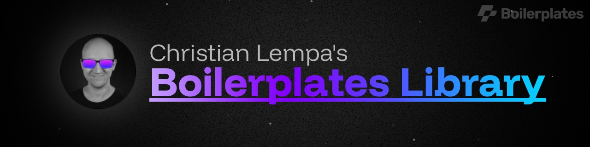

This repository is my personal **Boilerplates template library**.

It contains a growing collection of templates for homelabs and self-hosted infrastructure, covering Docker Compose, Docker Swarm, Kubernetes, Helm, Terraform, Ansible, Bash, and Python.

> I try to keep these templates up to date, but things change. If you find a broken template, outdated configuration, or any other issue, please open an issue here: [ChristianLempa/boilerplates-library/issues](https://github.com/ChristianLempa/boilerplates-library/issues).

## Template Types

- **Docker Compose**: application and service templates for local or single-host deployments.
- **Docker Swarm**: stack templates for Swarm-based environments.
- **Kubernetes**: reusable workload and resource templates such as Deployments, Services, Ingresses, Secrets, and more.
- **Helm**: Helm-based templates for common self-hosted platforms.
- **Terraform**: infrastructure templates for providers and services such as Cloudflare, Proxmox, and NetBird.
- **Ansible**: automation templates for server setup, Docker operations, backups, and maintenance.
- **Bash**: script-based utility templates.
- **Python**: script templates for small operational workflows.

## How To Use

These templates are meant to be used with the **Boilerplates application**, available at [christianlempa/boilerplates](https://github.com/christianlempa/boilerplates).

Each template in this repository includes metadata, variables, and one or more output files that Boilerplates can render for you. To use them, open Boilerplates, browse the template library, and pick the template that matches the platform or workflow you want to build. Then review the available variables, adjust them to your environment, and render the output files.

Before deploying anything, it is worth checking the generated files for ports, volumes, credentials, domains, image tags, provider settings, and other environment-specific values. Once everything looks correct, deploy the rendered files with the appropriate tool for that template.

## Contributing

Contributions are welcome. If you find a broken template, outdated configuration, missing feature, or anything else that should be improved, feel free to open an issue or submit a pull request.

If you want to contribute a new template or improve an existing one, keep the templates practical, reusable, and easy to adapt for real-world homelab and self-hosted setups.

### What Makes A Good Template

A good template should solve a real problem, be easy to understand, and be flexible enough to adapt to different environments. Clear variable names, sensible defaults, and straightforward rendered output go a long way.

Try to avoid hardcoded secrets, overly opinionated values that only fit one setup, or unnecessary complexity. The best templates are practical starting points that people can use quickly and customize with confidence.

## License

This repository is licensed under the [MIT License](./LICENSE).

Feel free to use, copy, modify, and share the templates. If you improve something, contributions back to the repository are always welcome!
